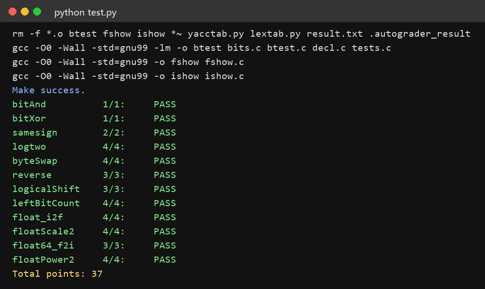

# datalab 报告

姓名：高光昊

学号：2025200687

| 总分 | bitAnd | bitXor | samesign | logtwo | byteSwap | reverse | logicalShift | leftBitCount | float_i2f | floatScale2 | float64_f2i | floatPower2 |
| ------ | ------ | ------ | ------ | ------ | ------ | ------ | ------ | ------ | ------ | ------ | ------ | ------ |
| 37.00 | 1.00 | 1.00 | 2.00 | 4.00 | 4.00 | 3.00 | 3.00 | 4.00 | 4.00 | 4.00 | 3.00 | 4.00 |

test 截图：



## 解题报告

### 亮点

1. **float_i2f** —— 用 while 一位一位找最高位（省符号数），并且专门处理了"舍入进位后有效数从 1.xxx 变成 2.0、指数要加一"的情况，符号数 29/30。
2. **logtwo** —— 二分的每一层把 `x<<k` 只算一次再复用，符号数 22（上限 25）。
3. **leftBitCount** —— 二分 + 用 `!` 把"全 1"变成 1，最后两位单独判断。
4. **float64_f2i** —— 不用 64 位类型、也不做强制类型转换，直接用 uf2 低 20 位和 uf1 拼出整数部分，符号数 20/60。

### bitAnd

```c
int bitAnd(int x, int y) {
    return ~(~x | ~y);
}
```

`&` 的特点是"全 1 则为 1"，而 `|` 是"有 1 则为 1"。把 x、y 都取反后，原本"全为 1"的位置变成全 0，这些位置用 `|` 得到 0（其余位置因为至少有一个 1 而为 1），再整体取反：原来全 1 的位置回到 1，其它位置全为 0，正好是 `x & y`。

### bitXor

```c
int bitXor(int x, int y) {
    return ~(x & y) & ~(~x & ~y);
}
```

异或为 1 的情况是"一个 0、一个 1"。`x&y` 取反后，为 1 的是"全 0"和"含 0 含 1"两类位置；`~x&~y` 取反后，为 1 的是"全 1"和"含 0 含 1"两类位置。两者相 `&`，只有"同时包含 0 和 1"的位置留下，即异或的结果（全 1、全 0 的位置分别被另一半消掉）。

### samesign

```c
int samesign(int x, int y) {
    if (!x) { if (!y) return 1; else return 0; }   // 0 既不正也不负：全 0 才算同号
    if (!y) return 0;
    return !((x >> 31) ^ (y >> 31));               // 都非 0：看符号位是否相同
}
```

0 既不是正数也不是负数，所以先把"至少一个为 0"的特殊情况单独处理（都 0 返回 1，只有一个 0 返回 0）。剩下两个都不为 0 时，只需比较最高位：右移 31 位取出符号位，相同则异或为 0，取反得到 1（异或的结果与题目要求刚好相反，所以要加 `!`）。

### logtwo

```c
int logtwo(int v) {
    int r = 0, x;
    x = (v >> 16) > 0; r = x << 4;  v = v >> r;          // 高 16 位里有 1 吗
    x = (v >> 8) > 0;  x = x << 3;  r = r | x;  v = v >> x;
    x = (v >> 4) > 0;  x = x << 2;  r = r | x;  v = v >> x;
    x = (v >> 2) > 0;  x = x << 1;  r = r | x;  v = v >> x;
    x = (v >> 1) > 0;  r = r | x;
    return r;
}
```

v 是 2 的幂，所以答案就是那个 1 的位置。类似二分查找：每次判断 1 在"前一半还是后一半"——先看高 16 位是否非 0，是就把 16 记进答案并把 v 右移 16 位（把已经确定的高位丢掉），否则不动；然后依次对 8、4、2、1 位做同样的事。

`(v >> k) > 0` 得到 0/1，再 `<< k` 就是这一位的权值。**优化点**：每层的 `x<<k` 只算一次，存回 x 里复用（`x = x<<3; r = r|x; v = v>>x;`），避免重复计算，符号数从 28 降到 22（上限 25）。

### byteSwap

```c
int byteSwap(int x, int n, int m) {
    int n1 = n << 3, m1 = m << 3;                  // 第几个字节 -> 第几位
    int diff = ((x >> n1) ^ (x >> m1)) & 0xFF;     // 两个字节挪到最低 8 位后做异或
    x = x ^ (diff << n1);
    x = x ^ (diff << m1);
    return x;
}
```

交换两个数可以用三次异或。这里要交换的两段位置不同，所以先把它们都移到最低 8 位（位置相同）做异或，得到"两个字节的差异位"；再把差异分别移回原来的两个位置与 x 异或。差异位以外的部分为 0，与 0 异或不变，于是两段字节被交换，其它字节不受影响。

### reverse

```c
v = ((v & 0xAAAAAAAA) >> 1) | ((v & 0x55555555) << 1);     // 1 位一组互换
v = ((v & 0xCCCCCCCC) >> 2) | ((v & 0x33333333) << 2);     // 2 位一组
v = ((v & 0xF0F0F0F0) >> 4) | ((v & 0x0F0F0F0F) << 4);     // 4 位一组
v = ((v & 0xFF00FF00) >> 8) | ((v & 0x00FF00FF) << 8);     // 8 位一组
v = ((v & 0xFFFF0000) >> 16) | ((v & 0x0000FFFF) << 16);   // 16 位一组
```

先看两位：交换一次就得到翻转结果。四位时，先奇偶位互换，再两位一组互换；八位时再加上四位一组互换。归纳到 32 位就是 5 步：1、2、4、8、16 位一组，用掩码把左右两半取出，分别向相反方向移位后再 `|` 起来（跨组的位互不影响）。

### logicalShift

```c
int logicalShift(int x, int n) {
    int mask = ~(((1 << 31) >> n) << 1);
    return (x >> n) & mask;
}
```

算术右移会用符号位把高位填满，所以关键是造一个掩码把多出来的高位抹掉：`1<<31` 只有符号位是 1，`>> n` 之后符号位向右扩展成"高 n 位全 1"，再 `<< 1` 就比需要抹掉的位数多一位，取反得到"低 32-n 位全 1"的掩码。与 `x >> n` 相与后，前面补进来的符号位被清零，结果就是逻辑右移。

好处是全程**不需要 unsigned**（本题的合法操作符里没有 unsigned，所以不能像 reverse 那样声明无符号变量）。

### leftBitCount

```c
y = !(~(x >> 16)); t += (y << 4); x = x << (y << 4);   // 前 16 位全为 1 吗
y = !(~(x >> 24)); t += (y << 3); x = x << (y << 3);   // 前 8 位
y = !(~(x >> 28)); t += (y << 2); x = x << (y << 2);   // 前 4 位
y = !(~(x >> 30)); t += (y << 1); x = x << (y << 1);   // 前 2 位
y = !(~(x >> 31)); t += y; x = x << y;                 // 前 1 位
y = !(~(x >> 31)); t += y;                             // 再看一次（x<<y 后可能仍为 1）
return t;
```

同样是二分：先判断前 16 位是否全为 1，是就把 16 累加进答案，并把 x 左移 16 位（丢掉已经数过的高位），再对剩下的部分依次判断 8、4、2、1 位。

判断"全 1"要用 `!(~(x >> k))`：`!` 只对 0 得 1，所以先把值取反，让"全 1"变成全 0，`!` 之后才是 1。注意最后一次左移之后符号位可能仍然是 1，所以再补判一次。

### float_i2f

```c
unsigned float_i2f(int x) {
    unsigned sign = x & 0x80000000, u = x, t, frac = 0, mask, rem, half, r = 0;
    int e = 0;
    if (sign) u = -u;                                  // 取绝对值
    if (u == 0) return 0;                              // 0 单独处理
    t = u;
    while (t >> 1) { t = t >> 1; e = e + 1; }          // 求最高位位置 e（= 指数 - 1）
    if (e < 24) {                                      // 整数位不超过 24 位：尾数左移补齐
        frac = (u << (23 - e)) & 0x7FFFFF;
    } else {                                           // 需要截断，做向偶数舍入
        mask = (1 << (e - 23)) - 1;
        frac = (u >> (e - 23)) & 0x7FFFFF;
        rem  = u & mask;
        half = (mask >> 1) + 1;
        if (rem > half) r = 1;                         // 多于半个单位 -> 进位
        if (rem == half) { if (frac & 1) r = 1; }      // 正好半个单位 -> 向偶数靠
        frac = frac + r;
        if (frac >> 23) { frac = 0; e = e + 1; }       // 进位后 1.xxx 变 2.0：指数 +1
    }
    return sign | ((e + 127) << 23) | frac;
}
```

三步：

1. **符号**：`x & 0x80000000` 直接取出符号位，负数取相反数得到绝对值。
2. **指数**：用 `while (t >> 1) { t >>= 1; e++; }` 逐位右移找到最高位位置 e（满足 2^e ≤ |x| < 2^(e+1)），指数部分 = e + 127。用循环而不是写 5 次 if，是因为本题符号数上限只有 30，循环的符号数是按"写出来的个数"算的，一次循环体只占 3 个符号。
3. **尾数**：整数位不超过 24 位时直接左移补齐；超过时要截掉低位，并做**向偶数舍入**——被截掉的低位大于半个单位就进位，正好等于半个单位时看尾数末位：末位是 1 才进位（让末位变成偶数）。这里最容易漏的是：进位可能让有效数从 `1.xxx` 变成 `2.0`，此时尾数要清 0 且指数加 1。

（本题合法操作符里没有 `&&`、`||`、`<=`，所以所有条件都拆成嵌套的 if 来写。）

### floatScale2

```c
if (exp == 255) return uf;                          // NaN / 无穷：直接返回
if (exp == 0) return sign | ((uf & 0x7FFFFFFF) << 1);  // 0 和非规格化数：尾数整体左移一位
return sign | ((exp + 1) << 23) | (uf & 0x7FFFFF);  // 正常数：指数 +1
```

乘 2 就是阶码加 1，所以正常数只要指数部分 +1、尾数不动。两种例外：指数全 1 表示 NaN/无穷，按要求原样返回；指数为 0 说明是 0 或非规格化数，此时乘 2 等价于把尾数（含隐含位）整体左移一位，符号位单独保留。

### float64_f2i

```c
int sign = uf2 >> 31;
int exp = (uf2 >> 20) & 0x7FF;
if (exp >= 0x7FF) return 0x80000000;      // NaN / 无穷
if (exp <= 0) return 0;                   // 0 和非规格化数
int E = exp - 1023;
if (E < 0) return 0;                      // |值| < 1，截断后为 0
if (E >= 31) return 0x80000000;           // 超出 int 范围
int hi = (1 << 20) | (uf2 & 0xFFFFF);     // uf2 低 20 位 + 隐含的 1
if (E <= 20) ans = hi >> (20 - E);        // 整数部分全在 hi 里
else ans = (hi << (E - 20)) | (uf1 >> (52 - E));   // 再接上 uf1 的高位
if (sign) ans = -ans;
return ans;
```

双精度是"符号 1 位 + 指数 11 位 + 尾数 52 位"，尾数跨 uf2（低 20 位）和 uf1（32 位）两个字。

1. **特判**：指数全 1 是 NaN/无穷，按要求返回 0x80000000；指数为 0 或 E < 0（绝对值小于 1）截断后是 0；E ≥ 31 超出 int 表示范围，也返回 0x80000000。
2. **有效数**：把 uf2 低 20 位补上隐含的 1，得到 21 位的 `hi`。
3. **取整数部分**：E ≤ 20 时整数部分全在 hi 里，直接右移 `20-E` 位；E > 20 时还要接上 uf1 里的高位，所以 `(hi << (E-20)) | (uf1 >> (52-E))`。
4. 题目要求向 0 取整，直接截断低位即可，最后按符号取负。

本题合法操作符里没有 `==`，也不允许使用 64 位类型和强制类型转换，所以比较一律用 `>=` / `<=`，并且用两个 32 位半字拼出结果，而不是先把尾数拼成 64 位整数再截断。

### floatPower2

```c
if (x >= 128) return 0x7F800000;      // 太大 -> +INF
if (x < -149) return 0;               // 太小 -> 0
if (x < -126) return 1 << (x + 149);  // 非规格化区
return (x + 127) << 23;               // 规格化区
```

按 x 分四段：x ≥ 128 时指数超过 254，直接返回 +INF；x < -149 时连非规格化数都表示不了，返回 0；-149 ≤ x ≤ -126 落在非规格化区，位表示是 `1 << (x+149)`（次方每减 1，尾数的 1 就往后挪一位）；-126 ≤ x ≤ 127 是规格化区，阶码存 x + 127，放在第 23 位起。
